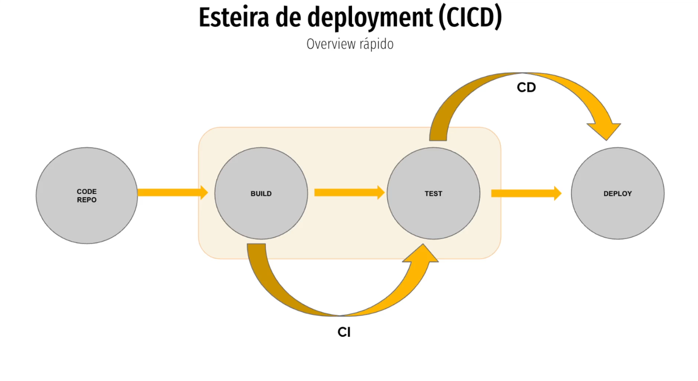
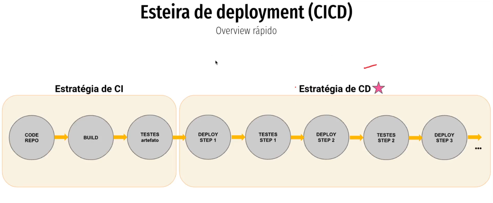

## Esteira de Deployment (CICD)

🔹 O que é CI/CD?

CI/CD significa Integração Contínua (CI) e Entrega/Implantação Contínua (CD).
É um conjunto de práticas de automação que ajuda equipes de desenvolvimento a entregar software mais rápido, com mais qualidade e menos erros.

🔹 1. CI – Continuous Integration (Integração Contínua)
👉 A ideia é integrar o código dos desenvolvedores em um repositório central várias vezes ao dia.
Cada alteração dispara builds automáticos e testes automatizados.
Objetivo: detectar erros cedo e garantir que o código sempre esteja funcionando.

Etapas típicas da CI:
O desenvolvedor envia código para o repositório (push).
O sistema de CI (ex: Jenkins, GitHub Actions, GitLab CI) roda:

Compilação/build

Testes unitários
Análise de qualidade de código
Se algo falha, o time é notificado imediatamente.

Benefícios:
Detectar bugs rapidamente.
Código sempre pronto para ser integrado.
Evita o famoso “funciona na minha máquina”.

🔹 2. CD – Continuous Delivery (Entrega Contínua)
👉 Uma extensão da CI.
Após o código ser integrado e testado, ele é preparado para implantação em produção.
Mas a publicação final pode exigir um clique ou aprovação manual.
Objetivo: Ter sempre uma versão pronta para liberar.

🔹 3. CD – Continuous Deployment (Implantação Contínua)
👉 É o próximo passo.
Toda mudança que passa pelos testes é implantada automaticamente em produção, sem intervenção manual.
Objetivo: Entregar valor aos usuários de forma rápida e contínua.

🔹 Comparação rápida

| Etapa               | O que é              | Automação até onde vai?                   |
| ------------------- | -------------------- | ----------------------------------------- |
| **CI**              | Integração Contínua  | Build + Testes                            |
| **CD (Delivery)**   | Entrega Contínua     | Pronto para deploy (manual para produção) |
| **CD (Deployment)** | Implantação Contínua | Vai até produção automático               |

🔹 4. Ferramentas comuns de CI/CD

- Jenkins
- GitHub Actions
- GitLab CI/CD
- CircleCI
- Azure DevOps Pipelines
- Bitbucket Pipelines

🔹 5. Benefícios do CI/CD

✅ Entregas rápidas e frequentes
✅ Menos bugs em produção
✅ Feedback rápido para desenvolvedores
✅ Menos riscos em cada release
✅ Melhora a colaboração entre times

👉 Resumindo:
CI = garantir que o código funciona sempre que alguém altera.
CD (Delivery) = ter o software sempre pronto para ser entregue.
CD (Deployment) = entregar automaticamente para produção.

# Arquivos
5. [Padrões de Deployment](/padroes_de_deployment.md)
    1. [Como definir sua estratégia](/estrategia_de_deployment.md)
    2. [In-Place vs Immutable](/in-place_deployment_immutable_deployment.md)
    3. [Esteira de Deploy](/CICD.md)
    4. [Full Deployment](/full_deployment.md)
    5. [Rolling Update](/rolling_update.md)
    6. [Blue Green](/blue_green_deployment.md)
    7. [Canary](/canary.md)
    7. [Shadow Deployment](/shadow.md)