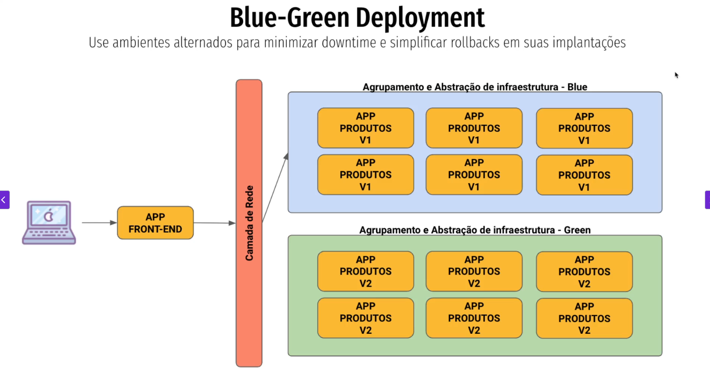
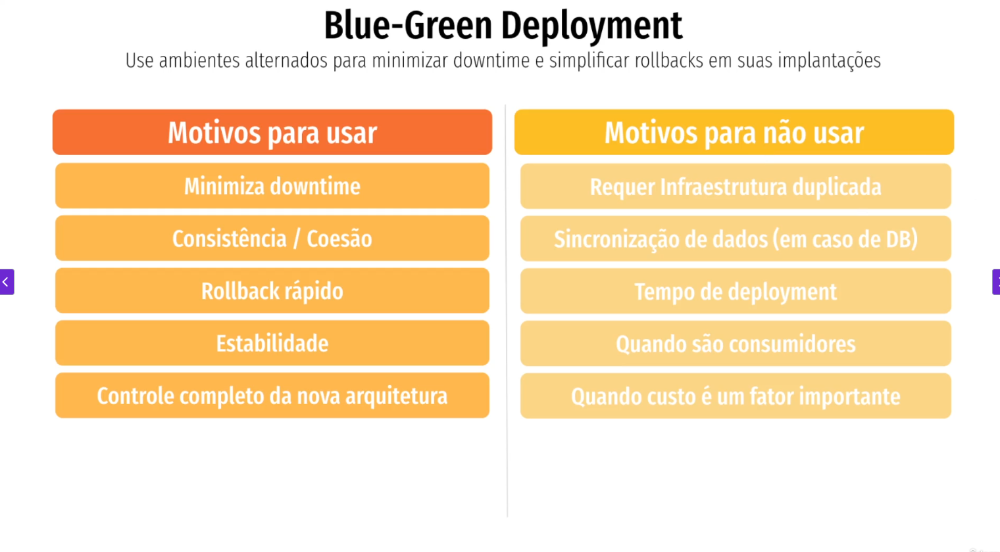

## Blue green Deployment
### Use para ambiente alternados para minimizar downtime e simplificar roolbacks em suas implantações.

Como funciona: Mantém duas versões do ambiente (Blue = atual, Green = nova). O tráfego é roteado para uma ou outra.
Vantagens: Rollback rápido (basta voltar para o ambiente antigo). Sem downtime.
Desvantagens: Requer o dobro de infraestrutura (custo maior).
Uso típico: Sistemas que não podem ter interrupção e precisam de rollback imediato.

# Arquivos
5. [Padrões de Deployment](/padroes_de_deployment.md)
    1. [Como definir sua estratégia](/estrategia_de_deployment.md)
    2. [In-Place vs Immutable](/in-place_deployment_immutable_deployment.md)
    3. [Esteira de Deploy](/CICD.md)
    4. [Full Deployment](/full_deployment.md)
    5. [Rolling Update](/rolling_update.md)
    6. [Blue Green](/blue_green_deployment.md)
    7. [Canary](/canary.md)
    7. [Shadow Deployment](/shadow.md)