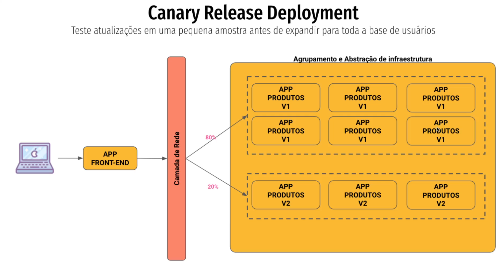
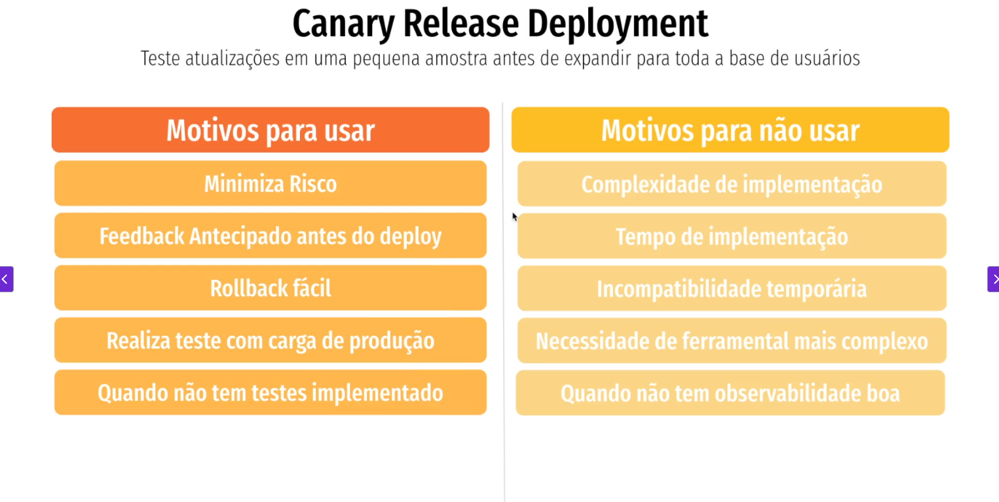

## Canary
### Teste atualizações em uma pequena amostra antes de expandir para toda a base de usuários.
Como funciona: A nova versão é liberada apenas para uma pequena porcentagem de usuários, aumentando gradualmente.
Vantagens: Reduz risco, fácil de medir impacto. Rollback rápido.
Desvantagens: Maior complexidade de roteamento/monitoramento.
Uso típico: Serviços críticos onde é necessário validar métricas de negócio e performance antes da liberação total.

# Arquivos
5. [Padrões de Deployment](/padroes_de_deployment)
    1. [Como definir sua estratégia](/estrategia_de_deployment.md)
    2. [In-Place vs Immutable](/in-place_deployment_immutable_deployment.md)
    3. [Esteira de Deploy](/CICD.md)
    4. [Full Deployment](/full_deployment.md)
    5. [Rolling Update](/rolling_update.md)
    6. [Blue Green](/blue_green_deployment.md)
    7. [Canary](/canary.md)
    7. [Shadow Deployment](/shadow.md)