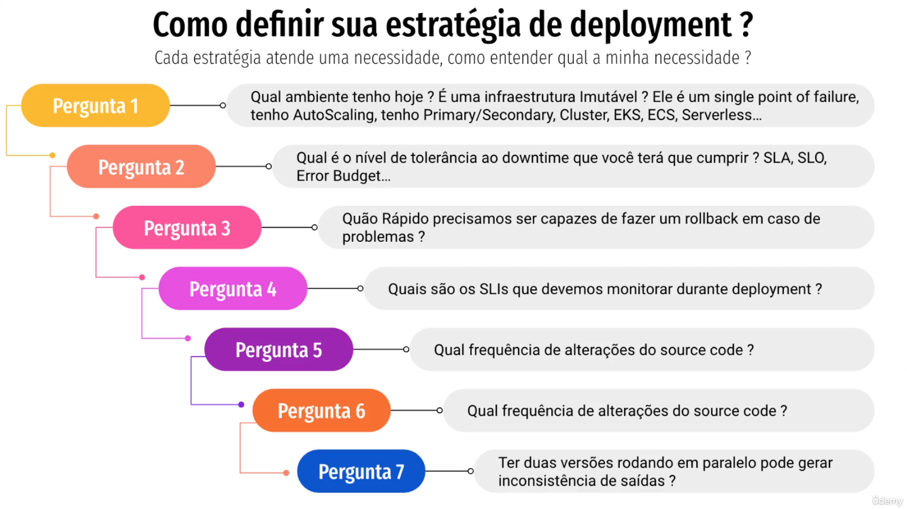

## Como definir sua estratégia de deployment? ##
### Cada estratégia atende uma necessidade, como entender qual a minha necessidade? ###

- 1: Qual o ambiente tenho hoje?
  - É uma estrutura imutável?
  - Ele é um single point of failure, tenho AutoScaling, tenho Primary/Secondary Cluster, EKS, ECS, Servless...
- 2: Qual o nível de tolerãncia ao downtime que voc/~e terá de fazer um rollback em caso de problemas?
- 3: Quão rápido precisamos ser capazes de fazer rollback em caso de problemas?
- Quais são os SLIs que devemos monitorar?
- Qual frequência de alterações do source code?
- Ter duas versões rodando em paralelo pode gerar inconsistência de saídas?

# Arquivos
5. [Padrões de Deployment](/padroes_de_deployment)
    1. [Como definir sua estratégia](/estrategia_de_deployment.md)
    2. [In-Place vs Immutable](/in-place_deployment_immutable_deployment.md)
    3. [Esteira de Deploy](/CICD.md)
    4. [Full Deployment](/full_deployment.md)
    5. [Rolling Update](/rolling_update.md)
    6. [Blue Green](/blue_green_deployment.md)
    7. [Canary](/canary.md)
    7. [Shadow Deployment](/shadow.md)

