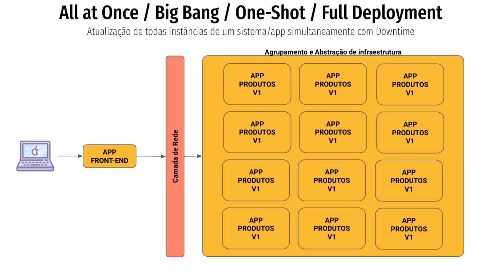
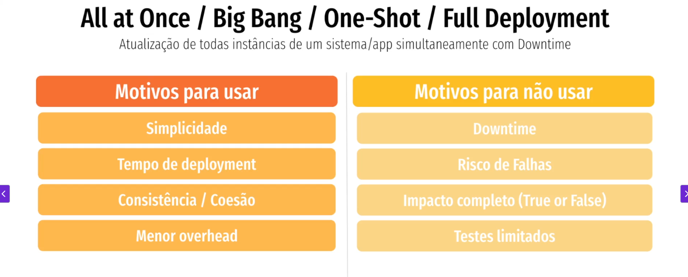

## All at Once / Big Bang / One-Shot / Full Deployment ##
### Atualiza todas as instâncias de um sistema/app simultaneamente com down time

# Arquivos
5. [Padrões de Deployment](/padroes_de_deployment.md)
    1. [Como definir sua estratégia](/estrategia_de_deployment.md)
    2. [In-Place vs Immutable](/in-place_deployment_immutable_deployment.md)
    3. [Esteira de Deploy](/CICD.md)
    4. [Full Deployment](/full_deployment.md)
    5. [Rolling Update](/rolling_update.md)
    6. [Blue Green](/blue_green_deployment.md)
    7. [Canary](/canary.md)
    7. [Shadow Deployment](/shadow.md)