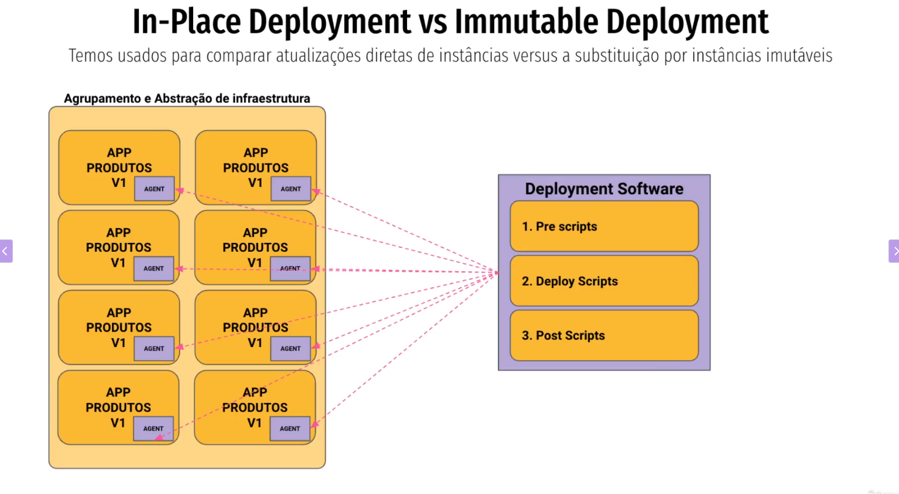
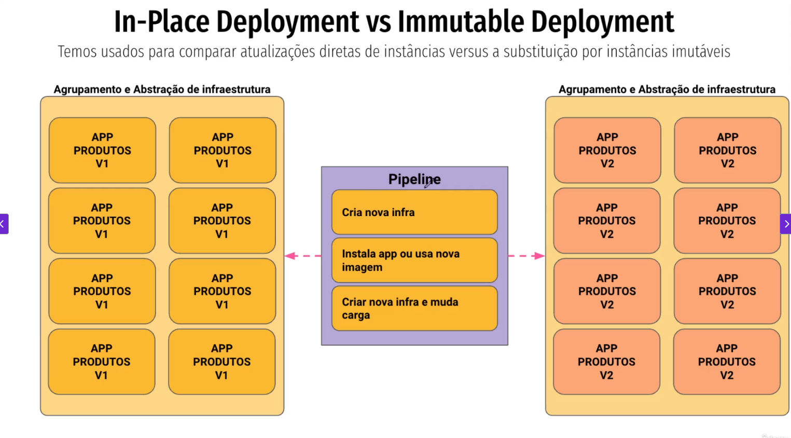
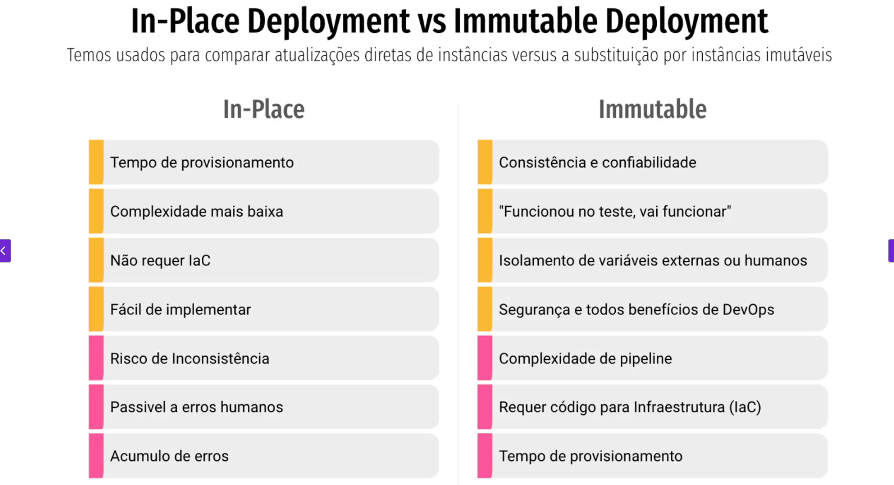

##  In-Place Deployment vc Immutable Deployment  ##
###  Temos usados para comparar atualizações diretas de inst/ãncias versus a substituição por inst/ãncias imutáveis  ####
Apaga a infra atual e cria uma nova.
- * In-Place deployment  ocorre em um servidor próprio. Pode ser utilizado um Agent instalado no servidor que é responsável pelo deploy.

- *  Immutable  é a utilização da mesma imagem em diversos ambientes.

## Camparativo ##

