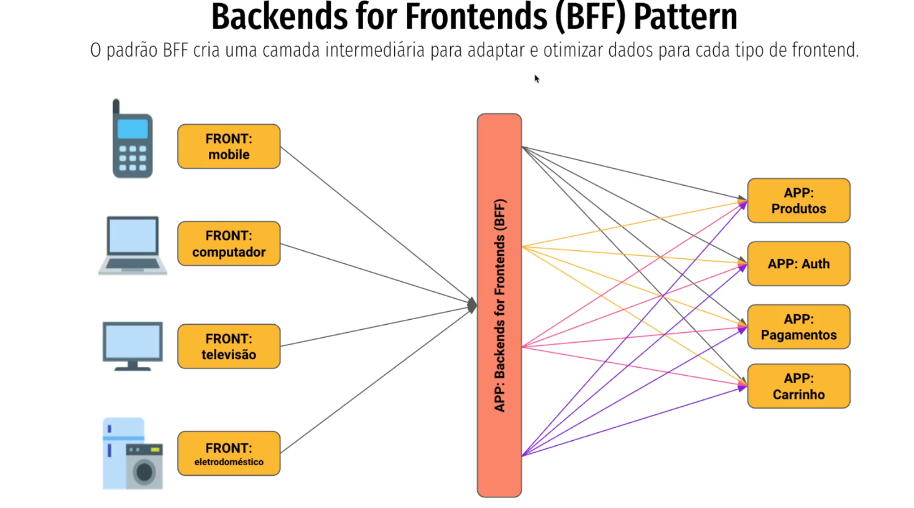

## BFF - Beckends for Frontends Patterns
#### O padrão BFF cria uma camada intermediária para adaptar e otimizar dados para cada tipo de frontend.

🔹 O que é o BFF – Backend for Frontend

O Backend for Frontend (BFF) é um padrão arquitetural onde você cria um backend específico para cada tipo de cliente (ex: web, mobile, smartwatch, IoT).

👉 Em vez de ter um único backend genérico atendendo todos os tipos de frontend, você cria camadas de backend dedicadas, que expõem exatamente os dados e funcionalidades que cada frontend precisa.

🔹 Problema que o BFF resolve

Em uma arquitetura de microserviços, os frontends (apps ou web) precisariam orquestrar várias chamadas para diferentes serviços.

Isso gera:

Complexidade no frontend (muito código para juntar dados).

Excesso de dados sendo enviados (payloads grandes que o app não usa).

Diferentes necessidades (ex: um app mobile precisa de menos detalhes que a versão web).

🔹 Como o BFF funciona

O frontend (ex: app mobile) não conversa diretamente com todos os microserviços.

Ele fala com o seu BFF dedicado.

O BFF atua como intermediário:

Faz as chamadas necessárias aos microserviços.

Agrega e transforma os dados.

Retorna apenas o que aquele frontend realmente precisa.

🔹 Exemplo prático

Imagine um sistema de e-commerce com microserviços:
Usuários
Produtos
Pedidos
Recomendações

Sem BFF:
O aplicativo mobile teria que chamar todos esses serviços diretamente e juntar as respostas.

Com BFF:
Criamos um Mobile BFF → Ele faz as requisições, junta os dados e devolve só as informações necessárias ao app.
Criamos um Web BFF → Pode retornar mais detalhes, pois a tela de desktop comporta mais informações.

🔹 Benefícios do BFF

✅ Frontends simplificados → menos lógica de integração.
✅ Respostas otimizadas → apenas os dados que cada cliente precisa.
✅ Evolução independente → se o app precisa de um novo endpoint, não afeta o frontend web.
✅ Performance → menos chamadas de rede, payloads menores.

🔹 Desvantagens
⚠️ Aumento de complexidade no backend → mais serviços para manter.
⚠️ Duplicação de lógica → pode existir lógica repetida entre diferentes BFFs.
⚠️ Gerenciamento difícil se houver muitos clientes diferentes.

🔹 Esquema visual simples
Frontend Web  →  Web BFF  → Microserviços
Frontend Mobile → Mobile BFF → Microserviços

Cada BFF serve como camada de adaptação entre o cliente e o ecossistema de microserviços.

👉 Resumindo:
O BFF é um backend sob medida para cada frontend, trazendo simplicidade, performance e flexibilidade.

