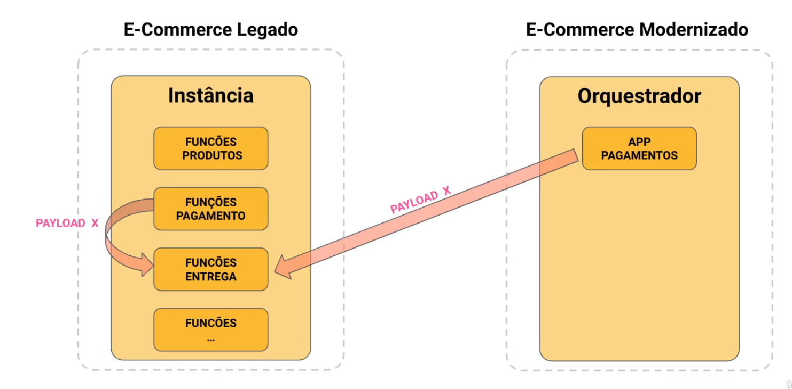
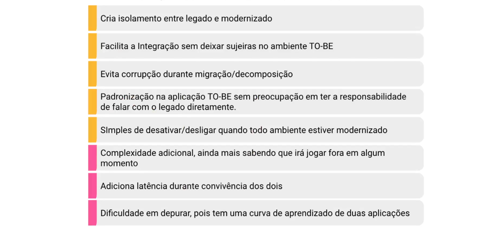

## Anti-Corruption Layer
### Isola e traduz interações entre sistemas diferentes para evitar dependências diretas

O Anti-Corruption Layer (ACL) é um padrão muito importante em Domain-Driven Design (DDD) e arquiteturas que lidam com sistemas legados ou integração entre contextos diferentes.

🔹 O que é o Anti-Corruption Layer (ACL)?
É uma camada de tradução e proteção usada quando um sistema precisa se comunicar com outro (geralmente legado ou externo), mas não queremos que os conceitos, modelos ou complexidades desse sistema contaminem o nosso domínio principal.

👉 Em outras palavras: o ACL funciona como um “intérprete” entre dois mundos, evitando que o modelo de dados de um sistema corrompa o outro.

🔹 Problema que resolve

Sistemas legados costumam ter modelos ruins, inconsistentes ou confusos.
Se você integra diretamente com eles, sua aplicação pode acabar herdando essa complexidade.

O ACL cria uma camada de tradução/adaptação:
O seu sistema fala a sua linguagem (seu modelo de domínio).
O ACL traduz isso para a linguagem do sistema legado (e vice-versa).

🔹 Como funciona
O domínio principal chama o Anti-Corruption Layer (em vez de falar direto com o legado).
O ACL conversa com o sistema externo/legado.
O ACL faz a tradução de modelos e retorna para o seu sistema no formato que ele entende.

🔹 Exemplo prático
Imagine que você tem um sistema moderno de e-commerce e precisa integrar com um sistema legado de estoque que representa produtos de forma diferente:
Seu sistema:
{
"id": 101,
"nome": "Notebook Dell",
"quantidade": 5
}

Sistema legado:

{
"cod_prod": "NBK-D123",
"desc": "Dell Inspiron",
"qtd_disp": "05"
}

👉 Se você integrar diretamente, seu sistema moderno pode ser poluído por esse modelo ruim.
👉 Com o ACL, você cria uma camada que traduz automaticamente entre os dois formatos.

🔹 Benefícios

✅ Protege o modelo de domínio de influências ruins.
✅ Facilita a evolução → se o legado mudar, só o ACL precisa ser atualizado.
✅ Reduz o acoplamento entre sistemas.
✅ Clareza → cada sistema continua falando sua própria linguagem.

🔹 Desvantagens
⚠️ Mais complexidade extra (mais código para manter).
⚠️ Pode trazer sobrecarga de desempenho se o mapeamento for muito pesado.

🔹 Quando usar?
Integrações com sistemas legados.
Comunicação entre bounded contexts diferentes em DDD.
Situações em que o modelo externo não deve influenciar seu modelo interno.

🔹 Resumindo
O Anti-Corruption Layer é como um escudo tradutor:
Ele protege seu domínio principal.
Traduz dados de/para sistemas externos.
Evita que o legado “corrompa” a clareza e pureza do seu sistema.

