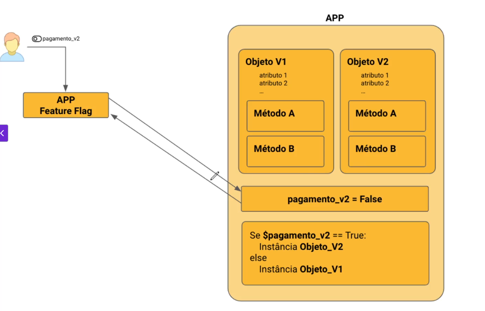
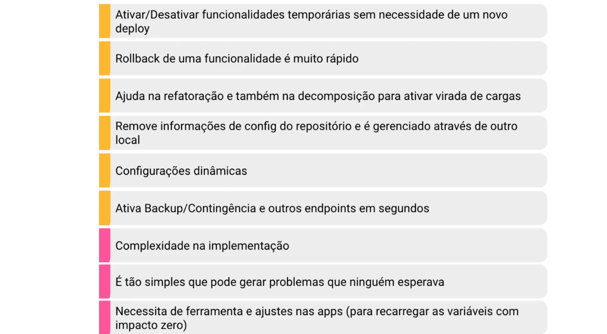

## Feature Flag / Feature Toggle.
### Técnica que permite ativar ou desativar fucnionalidades em produção sem necessidade de novo deploy.

🔹 O que é Feature Flag?
É um padrão de design usado para ativar ou desativar funcionalidades no software em tempo de execução, sem precisar fazer um novo deploy.

Funciona como um interruptor lógico:
Flag ligada → a nova funcionalidade aparece para o usuário.
Flag desligada → a funcionalidade fica oculta ou o sistema usa o comportamento antigo.

🔹 Como funciona na prática?
No código, a nova feature fica protegida por uma condicional:
if (FeatureFlags.isEnabled("nova_funcionalidade")) {
mostrarNovaFuncionalidade();
} else {
mostrarFuncionalidadeAntiga();
}

Essa flag pode ser controlada por:
Arquivos de configuração
Variáveis de ambiente
Serviços de gerenciamento de flags (ex: LaunchDarkly, Unleash, Firebase Remote Config)
Assim, a equipe pode ativar ou desativar a funcionalidade em tempo real, sem reimplantar a aplicação.

🔹 Tipos de Feature Flags
Release Toggles – esconder uma feature até estar pronta para todos.
Experiment Toggles – rodar testes A/B para comparar versões diferentes.
Ops Toggles – desligar partes do sistema em caso de problemas ou sobrecarga.
Permission Toggles – liberar funcionalidades só para certos usuários (beta testers, clientes premium).

🔹 Vantagens
✅ Maior segurança → é possível ativar a feature para poucos usuários antes de expandir.
✅ Rollback rápido → basta desligar a flag se algo der errado (sem rollback de código).
✅ Suporte a experimentação → permite rodar testes A/B e releases canary.
✅ Separação de deploy e release → você pode colocar código em produção sem “ligar” a feature.

🔹 Desvantagens
⚠️ Complexidade no código → muitas condicionais deixam o código difícil de manter.
⚠️ Dívida técnica → se a flag não for removida depois, vira “lixo” no sistema.
⚠️ Gestão das flags → com muitas features simultâneas, fica difícil de controlar sem uma ferramenta dedicada.

🔹 Exemplo prático (cenário de e-commerce)
Você cria uma nova tela de checkout.
Coloca a funcionalidade sob uma feature flag.
Ativa apenas para os funcionários internos.
Depois ativa para 5% dos clientes reais.
Se não houver problemas, expande até 100%.
Se surgir um bug grave, basta desligar a flag sem precisar reverter o deploy.

