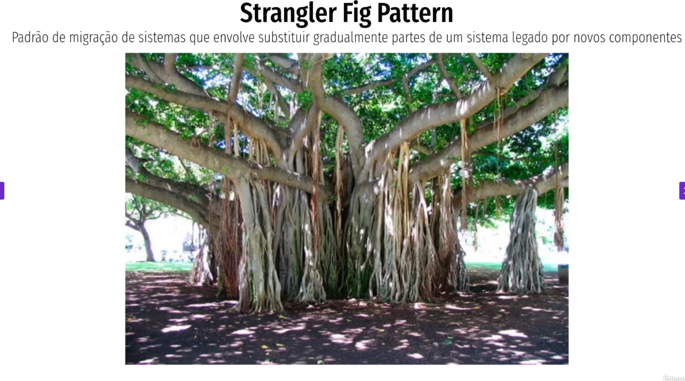
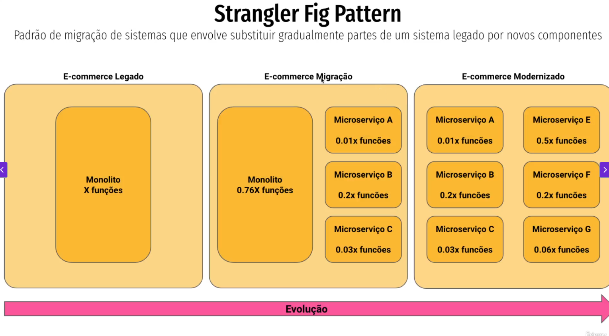
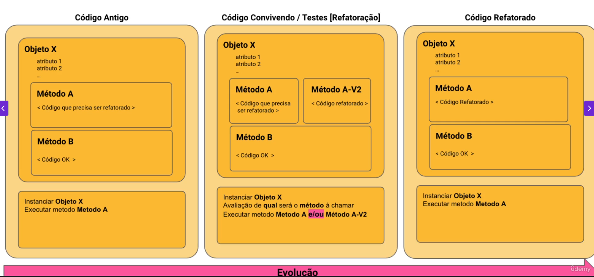
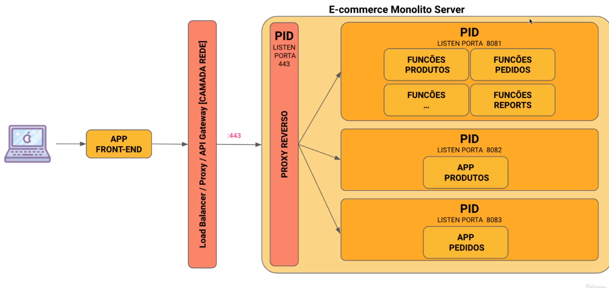
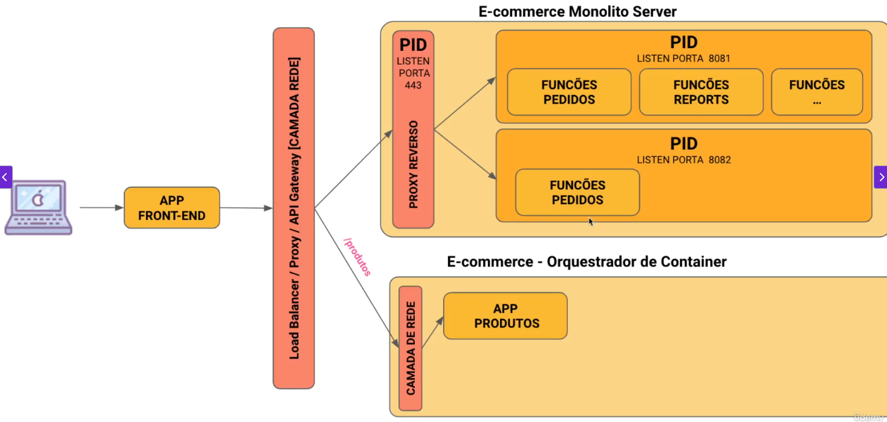
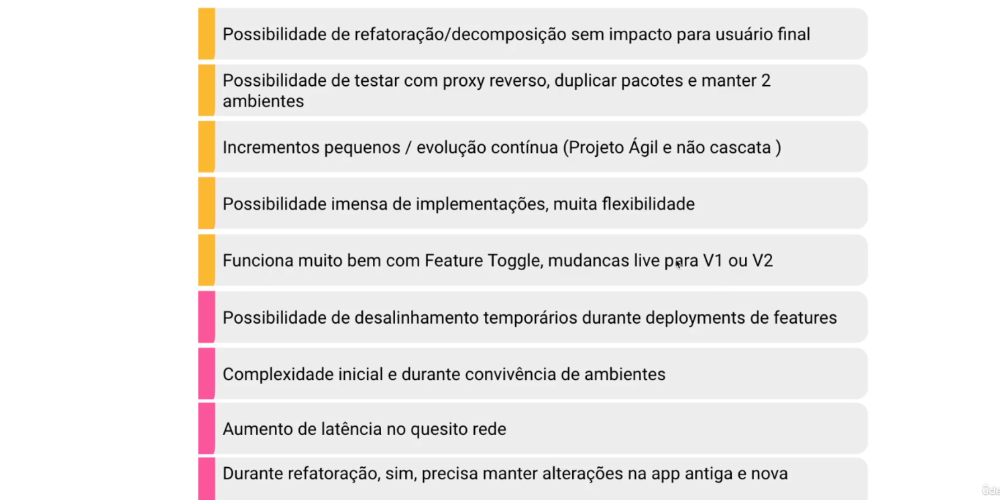

## Strangler Fig Parttern
### Padrão de migração de sistemas que envolve substituir gradualmente partes de um sistema legado por novos componentes

🌳 O que é o Strangler Fig Pattern?
O nome vem de uma árvore chamada figueira-estranguladora (strangler fig), que cresce em volta de outra árvore, pouco a pouco, até substituí-la completamente.

👉 Na arquitetura de software, o Strangler Fig Pattern é uma abordagem para substituir sistemas legados gradualmente, criando uma nova aplicação em paralelo, que vai assumindo funcionalidades aos poucos até que o sistema antigo possa ser desligado.

🔹 Como funciona
O sistema legado continua funcionando.
Criamos novos serviços ou módulos que substituem partes do legado.
Colocamos uma camada de roteamento (proxy, API Gateway, load balancer) para decidir:
    Quais requisições ainda vão para o legado.
    Quais já vão para o novo sistema.
Aos poucos, migramos todas as funcionalidades.
Quando tudo estiver no novo sistema, desligamos o legado.

🔹 Exemplo prático
Imagine que você tem um sistema de e-commerce legado (monólito) que lida com:
    Cadastro de usuários
    Produtos
    Carrinho de compras
    Pagamentos

Você decide modernizar:
Primeiro, cria um novo microserviço de usuários.
O gateway redireciona chamadas de "usuários" para o novo serviço, mas "carrinho" e "pagamentos" ainda ficam no monólito.
Depois, migra o carrinho, depois produtos, depois pagamentos.
No fim, o monólito é desligado.

🔹 Benefícios

✅ Reduz risco → não precisa migrar tudo de uma vez (big bang).
✅ Permite evolução gradual.
✅ Usuários continuam usando o sistema durante a transição.
✅ Facilita rollback se algo der errado (volta pro legado).

🔹 Desvantagens

⚠️ Camada de roteamento complexa.
⚠️ Coexistência de dois sistemas durante muito tempo pode aumentar a manutenção.
⚠️ Possibilidade de inconsistência temporária entre legado e novo.

🔹 Esquema visual simplificado
Usuários → [API Gateway] → (parte A: legado, parte B: novo sistema)

Com o tempo, tudo migra para o novo sistema.

👉 Resumindo:
O Strangler Fig Pattern é uma estratégia de modernização incremental para migrar sistemas legados, criando novos serviços em paralelo e redirecionando gradualmente o tráfego até desligar o antigo.

