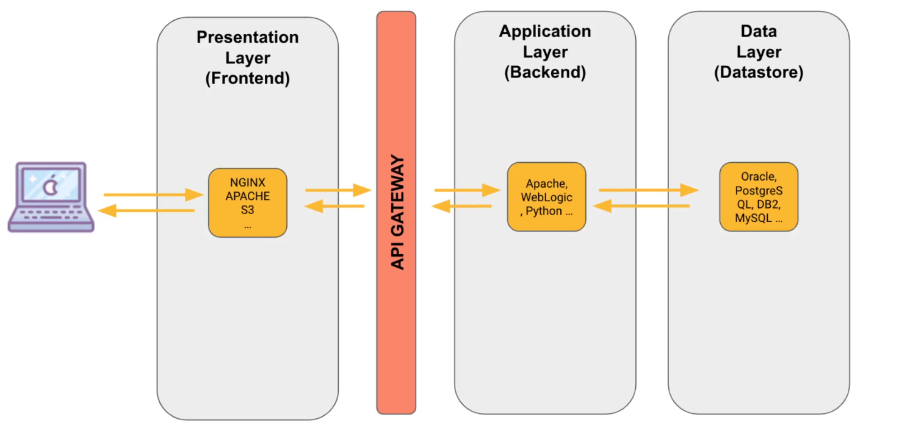
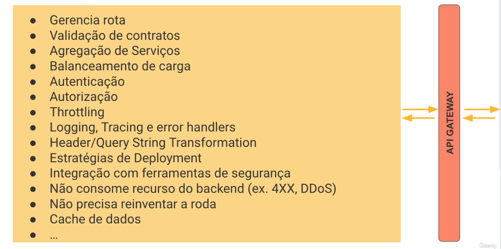

## API Gateway
### Api Gateway é um pattern

🔹 O que é API Gateway?

Um API Gateway é um ponto de entrada único para todas as requisições externas a um sistema que possui múltiplos serviços (microserviços).

Ele atua como “porteiro” que:
Recebe as requisições do cliente.
Encaminha para os microserviços corretos.
Pode agregar respostas de múltiplos serviços.
Aplica políticas de segurança, autenticação e controle de tráfego.

🔹 Por que usar API Gateway?
Abstrair complexidade → o cliente não precisa saber sobre múltiplos microserviços.
Segurança centralizada → autenticação, autorização, SSL.
Balanceamento de carga → distribui requisições entre instâncias de microserviços.
Transformação de protocolo → converte entre HTTP, WebSocket, gRPC, etc.
Agregação de respostas → retorna dados combinados de vários serviços em uma única resposta.

🔹 Como funciona (fluxo típico)
Cliente faz uma requisição HTTP para o API Gateway:
GET /pedidos/123
O API Gateway decide qual microserviço deve tratar a requisição (ex: serviço de pedidos).
O microserviço processa e retorna a resposta ao gateway.
O gateway envia a resposta consolidada para o cliente.

🔹 Benefícios
✅ Ponto único de entrada → simplifica o consumo da API pelo cliente.

✅ Desacoplamento → clientes não precisam conhecer a estrutura interna dos microserviços.

✅ Segurança → autenticação, autorização e proteção contra ataques centralizados.

✅ Monitoramento e logging centralizados → fácil rastrear requisições.

🔹 Desvantagens
⚠️ Ponto único de falha → se o gateway cair, todos os serviços ficam inacessíveis.
⚠️ Sobrecarga → pode se tornar um gargalo se não for dimensionado corretamente.
⚠️ Complexidade adicional → precisa gerenciar rotas, transformações e regras de negócio no gateway.

🔹 Exemplo prático
Imagine um e-commerce com 3 microserviços:
Serviço de pedidos
Serviço de usuários
Serviço de pagamento

Sem gateway: o cliente precisa chamar 3 endpoints diferentes diretamente → maior complexidade e acoplamento.
Com gateway:

GET /api/pedido/123

O API Gateway encaminha para o microserviço de pedidos, agrega dados de usuário e pagamento se necessário, e devolve uma única resposta para o cliente.

📌 Resumo em uma frase:
O API Gateway é o porteiro e tradutor central que simplifica a comunicação entre clientes e múltiplos microserviços, trazendo segurança, monitoramento e desacoplamento.

