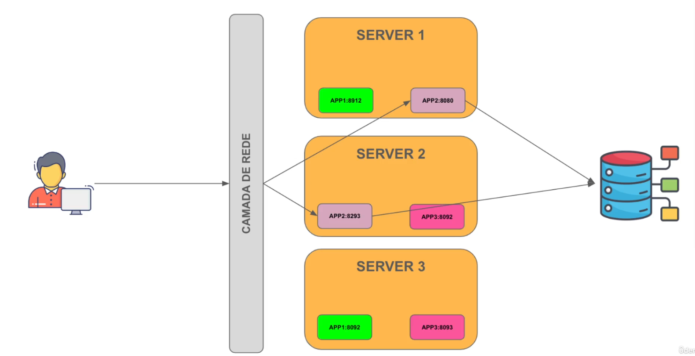
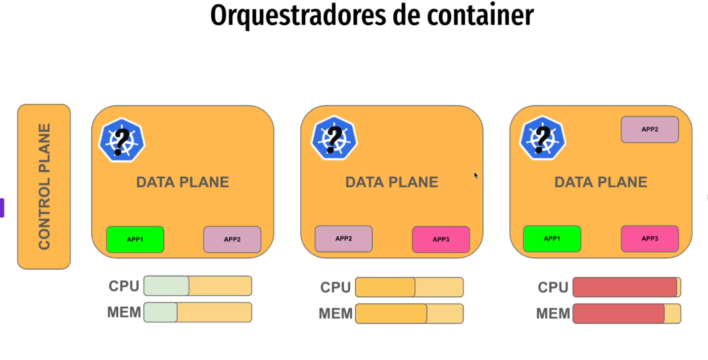
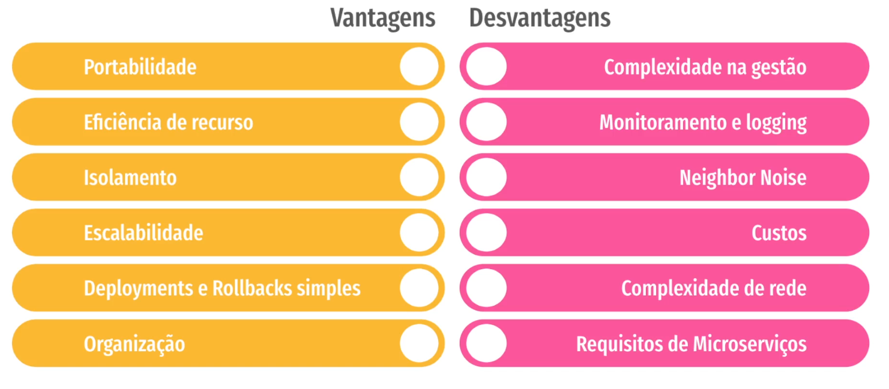

## Arquitetura com Containers

🔹 O que é arquitetura com containers?

Containers são unidades leves e isoladas que contêm uma aplicação e tudo o que ela precisa para rodar (bibliotecas, dependências, runtime), garantindo que funcione de forma consistente em qualquer ambiente.

Quando falamos de arquitetura com containers, nos referimos a organizar sistemas inteiros usando containers, ao invés de instalar serviços diretamente em máquinas físicas ou VMs tradicionais.

🔹 Como funciona

Cada serviço ou microserviço roda em seu próprio container.

Containers são isolados, mas podem se comunicar via rede interna.

Um orquestrador de containers (ex: Kubernetes, Docker Swarm) gerencia:

Escalabilidade automática

Distribuição de carga

Recuperação de falhas

🔹 Componentes comuns

Docker → cria e executa containers.

Dockerfile → descreve como construir o container (aplicação + dependências).

Registry → repositório de imagens de containers (Docker Hub, AWS ECR).

Orquestradores → Kubernetes, Docker Swarm, OpenShift, que gerenciam múltiplos containers em produção.

🔹 Benefícios

✅ Portabilidade → roda igual no laptop, staging ou produção.

✅ Escalabilidade → fácil criar várias instâncias de um serviço.

✅ Isolamento → falhas em um container não afetam os outros.

✅ Deploy rápido → containers podem ser criados, substituídos ou destruídos rapidamente.

✅ Microserviços-friendly → cada serviço roda em seu container, desacoplado.

🔹 Arquitetura típica com containers

Imagine um sistema de e-commerce:

[Frontend React]        -> Container 1
[API Gateway]           -> Container 2
[Serviço de Produtos]   -> Container 3
[Serviço de Pedidos]    -> Container 4
[Banco de Dados]        -> Container 5
[Cache Redis]           -> Container 6
[Kubernetes]            -> Orquestra todos os containers

Cada container tem sua própria imagem e pode ser substituído ou escalado independentemente.

O Kubernetes garante que sempre haja containers suficientes rodando, balanceia carga e reinicia containers que falham.

🔹 Stateful x Stateless em containers

Stateless containers → ideais para microserviços web/API, pois podem ser facilmente escalados.

Stateful containers → bancos de dados ou sistemas que precisam persistir dados requerem volumes ou storage externo.

🔹 Resumindo

A arquitetura com containers permite:

Isolamento de serviços

Deploy e escalabilidade rápidos

Portabilidade entre ambientes

Integração natural com microserviços e DevOps

