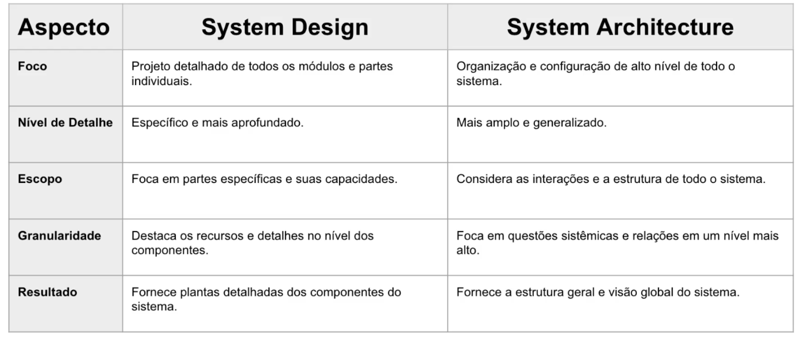

## System Design e System Architecture
### São iguais porém, diferentes.

System Design e System Architecture parecem sinônimos, mas têm escopos e níveis diferentes. Vou te explicar de forma clara:

🔹 System Design

👉 É o processo de projetar como um sistema deve funcionar, considerando seus requisitos funcionais (o que o sistema deve fazer) e não funcionais (desempenho, escalabilidade, segurança, etc.).

Exemplos de perguntas em System Design:
Como projetar o feed de notícias do Facebook?
Como projetar um sistema de chat como o WhatsApp?
Como lidar com milhões de requisições por segundo?
Onde usar cache, filas, banco de dados relacional ou NoSQL?

🔧 Envolve:
Escolha de componentes (banco, cache, balanceador, API Gateway, filas, etc.).
Definição de fluxos de dados.
Trade-offs (ex: usar banco NoSQL → mais escalável, mas pode perder consistência).

⚡ É mais prático e próximo da implementação.

🔹 System Architecture

👉 É a visão de alto nível de como os componentes do sistema se organizam e interagem, quase como um mapa estrutural.
Ela define os blocos fundamentais e como eles se conectam, antes mesmo de decidir detalhes técnicos específicos.

Exemplos de perguntas em System Architecture:
Vamos usar monólito ou microserviços?
O sistema será orientado a eventos ou request-response?
Quais bounded contexts existem no domínio?
O sistema terá camadas em 3-tier (aplicação, negócio, banco) ou algo mais distribuído?

🔧 Envolve:
Macroestrutura do sistema.
Princípios de organização (DDD, hexagonal, camadas, microserviços, etc.).
Interações entre subsistemas.

⚡ É mais conceitual e próximo do planejamento estratégico do sistema.

🔹 Diferença resumida

| Aspecto            | System Architecture            | System Design                                                  |
| ------------------ | ------------------------------ | -------------------------------------------------------------- |
| **Nível**          | Alto nível, conceitual         | Mais baixo, detalhado                                          |
| **Foco**           | Estrutura do sistema           | Implementação e escolha de tecnologias                         |
| **Pergunta-chave** | "Como os blocos se organizam?" | "Como resolver requisitos técnicos específicos?"               |
| **Exemplo**        | "Vamos usar microserviços?"    | "Como cada microserviço vai se comunicar (REST, gRPC, Kafka)?" |

🔹 Analogia simples
System Architecture → O projeto do prédio (quantos andares, fundação, tubulações principais, onde ficam os elevadores).
System Design → O detalhe de cada andar (disposição de salas, iluminação, móveis, encanamento dentro de cada apartamento).