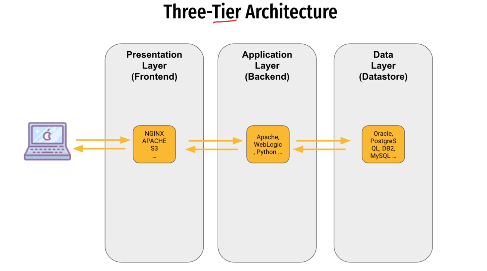

O padrão Three-Tier Architecture (arquitetura em três camadas) é um dos modelos arquiteturais mais clássicos da engenharia de software. Ele divide uma aplicação em três camadas principais, cada uma com responsabilidades bem definidas.

🔹 As Três Camadas
1. Camada de Apresentação (Presentation Tier)

É a interface do usuário – tudo que o usuário vê e interage.

Pode ser um site, aplicativo mobile ou interface desktop.

Função: receber entradas do usuário e mostrar resultados.

👉 Exemplos:

Páginas HTML, React, Angular, Flutter, etc.

2. Camada de Lógica de Negócio (Application / Business Logic Tier)

É o coração da aplicação, onde ficam as regras de negócio.

Processa requisições vindas da camada de apresentação.

Decide como os dados devem ser tratados e coordena interações com a camada de dados.

👉 Exemplos:

Serviços REST em Java/Spring, .NET, Node.js, Python/Django.

3. Camada de Dados (Data Tier)

Responsável por armazenar e recuperar dados.

Normalmente é um banco de dados (relacional ou NoSQL).

Não contém regras de negócio, apenas persistência.

👉 Exemplos:

PostgreSQL, MySQL, MongoDB, Redis.

🔹 Como funciona o fluxo

Usuário faz login na interface web/app (camada de apresentação).

A lógica de negócio valida as credenciais, aplica regras (ex: autenticação, autorização).

Se precisar, consulta o banco de dados (camada de dados) para verificar o usuário.

O resultado retorna para a camada de negócio, que decide o que mostrar.

A camada de apresentação exibe para o usuário.

🔹 Benefícios

✅ Separação de responsabilidades → cada camada tem um papel claro.

✅ Escalabilidade → você pode escalar somente a camada que precisa (ex: mais instâncias do backend).

✅ Manutenção facilitada → alterações em uma camada têm menos impacto nas outras.

✅ Reuso → a mesma camada de negócio pode servir diferentes interfaces (web, mobile, API).

🔹 Exemplo prático

💻 Imagine um sistema de e-commerce:

Apresentação → Site (React) + App Mobile (Flutter).

Lógica de Negócio → API em Node.js que processa pedidos, calcula frete, controla estoque.

Dados → Banco PostgreSQL para produtos e pedidos + Redis para cache de sessões.

📌 Resumo em uma frase:
O padrão Three-Tier Architecture organiza um sistema em interface (UI), lógica de negócio e dados, promovendo organização, manutenção e escalabilidade.

