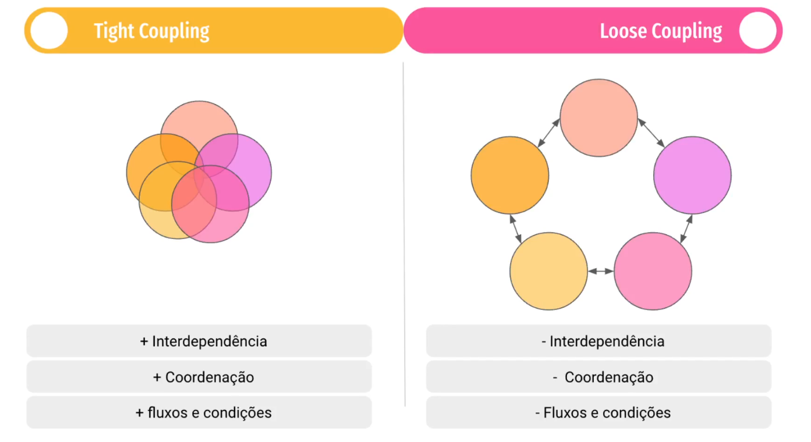

## Tight Coupling e Loose Coupling

🔹 Tight Coupling (Acoplamento Forte)

Um sistema ou módulo tem tight coupling quando depende fortemente de outro módulo, ou seja:

Mudanças em um módulo afetarão diretamente o outro.

Reutilizar o módulo em outro contexto é difícil.

Dificulta testes unitários e manutenção.

💡 Exemplo prático:
class BancoDados {
void salvarDados(String dados) {
System.out.println("Salvando: " + dados);
}
}

class ServicoUsuario {
BancoDados db = new BancoDados(); // instanciando diretamente
void criarUsuario(String nome) {
db.salvarDados(nome);
}
}
ServicoUsuario depende diretamente da implementação de BancoDados.

Se mudar a forma de salvar dados, ServicoUsuario também precisará mudar.

🔹 Loose Coupling (Acoplamento Fraco)

Um sistema tem loose coupling quando os módulos são independentes, comunicando-se através de interfaces ou abstrações, não implementações concretas.

Mudanças em um módulo não afetam diretamente os outros.

Facilita testes unitários, manutenção e escalabilidade.

Promove reuso e flexibilidade.

💡 Exemplo prático usando interface:

interface Repositorio {
void salvar(String dados);
}

class BancoDados implements Repositorio {
public void salvar(String dados) {
System.out.println("Salvando: " + dados);
}
}

class ServicoUsuario {
private Repositorio repo;

    ServicoUsuario(Repositorio repo) {
        this.repo = repo;
    }
    
    void criarUsuario(String nome) {
        repo.salvar(nome);
    }
}

ServicoUsuario não conhece a implementação concreta de Repositorio.

Podemos trocar BancoDados por outro tipo de armazenamento sem mudar ServicoUsuario.

🔹 Comparação resumida

| Aspecto       | Tight Coupling | Loose Coupling       |
| ------------- | -------------- | -------------------- |
| Dependência   | Forte, direta  | Fraca, via abstração |
| Flexibilidade | Baixa          | Alta                 |
| Testes        | Difíceis       | Fáceis (mock/stub)   |
| Reuso         | Difícil        | Fácil                |
| Manutenção    | Difícil        | Mais simples         |

🔹 Analogia

Tight Coupling: dois blocos de LEGO grudados com supercola → se um quebra, o outro também quebra.

Loose Coupling: dois blocos de LEGO conectados por pinos → um pode ser trocado sem afetar o outro.